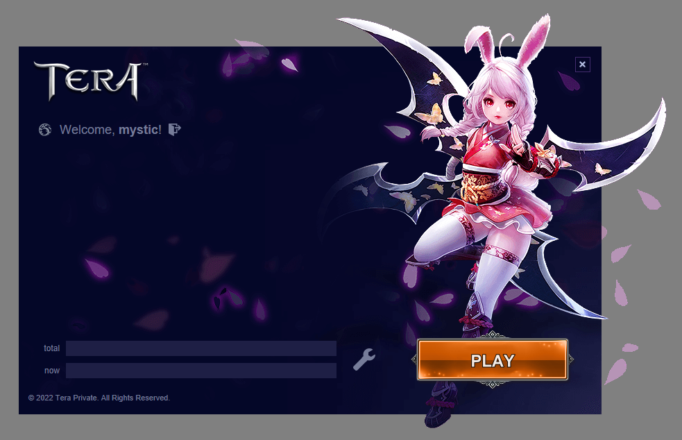
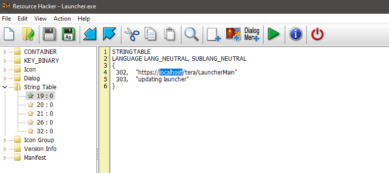
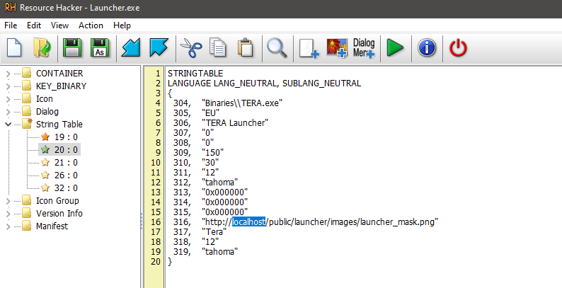

# tera-launcher

Launcher for Tera Online retail servers.   
Based on the official version of the launcher developed by BHS.

Note: this design is available when using our tera-api.

## Usage in your project

In order to use this launcher in your private tera server project, you need to use our version of [tera-api](https://github.com/justkeepquiet/tera-api), and also modify the executable file using the [Resource Hacker](http://www.angusj.com/resourcehacker/) program.

The repository also includes [a script](installer) for the Inno Setup installer, which allows you to create an installer with support for automatic updates.

### Change URL address

To change the URL address of launcher API, you need to use the Rusource Hacker program. Open the program and change the address in two places (see screenshots). The address must correspond to the URL where the Portal server of tera-api is located (all static files are places in the `public` folder on tera-api).

### Place launcher on your host

In order for the launcher to automatically update itself, you need to place the [launcher_info.ini](public/patch/launcher_info.ini) in the `patch` directory on your server (you can use `public` folder of tera-api). This file specifies the version of the launcher, as well as the download address of the installer. After each update of the launcher, you need to change the version in the Inno Setup script, as well as edit the launcher executable file (change the version) using the Resource Hacker program.

## Support automatic game update

This launcher supports all the functions of automatic game update and file integrity check. For these features to work, you need to use our [tera-api](https://github.com/justkeepquiet/tera-api). Solution for packing (patcher) Tera client files is available in the repository: https://github.com/justkeepquiet/tera-client-packer
